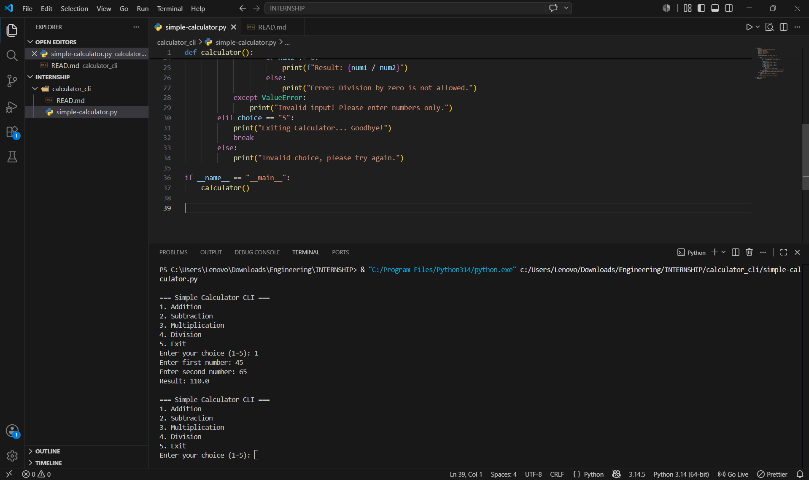

# 🧮 Simple Calculator CLI in Python

## 📌 Project Overview
This project is a **Command Line Interface (CLI) Calculator** built in Python.  
It allows users to perform basic arithmetic operations (Addition, Subtraction, Multiplication, Division) directly from the terminal in an interactive menu-driven format.

---

## ✨ Features
- Menu-driven interface for easy navigation
- Supports:
  - ➕ Addition
  - ➖ Subtraction
  - ✖️ Multiplication
  - ➗ Division (with division by zero check)
- Error handling for invalid inputs
- Continuous loop until user chooses to exit

---

## 🛠️ Technologies Used
- **Python 3.0**
- Standard input/output (`print`, `input`)
- Conditional statements (`if-elif-else`)
- Looping (`while True`)

---

### Output Screen
Below is a sample output of the calculator running in the terminal:


---
### ▶️ Getting Started (How to Run)

To run this calculator on your local machine, follow these steps:

#### Step 1: Clone the Repository

Open your terminal or command prompt and execute the following command:

```bash
git clone https://github.com/your-username/python-calculator-cli.git
```

#### Step 2: Navigate to the Project Directory

Change into the newly cloned project folder:

```bash
cd python-calculator-cli
```

#### Step 3: Run the Python Script

Execute the main application file (assuming it's named `calculator.py` or similar):

```bash
python calculator.py
```

*(Note: You might need to use `python3` instead of `python` depending on your system configuration.)*


---


EXAMPLE

=== Simple Calculator CLI ===
1. Addition
2. Subtraction
3. Multiplication
4. Division
5. Exit
Enter your choice (1-5): 1
Enter first number: 10
Enter second number: 5
Result: 15.0

---

📂 File Structure

calculator-cli/

│── calculator.py   # Main Python program

│── README.md       # Project documentation

---

🎯 Learning Outcomes
Understanding CLI-based applications in Python

Practicing loops, conditionals, and error handling

Building a user-friendly interactive program
